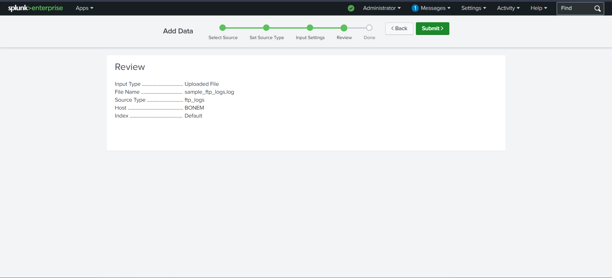
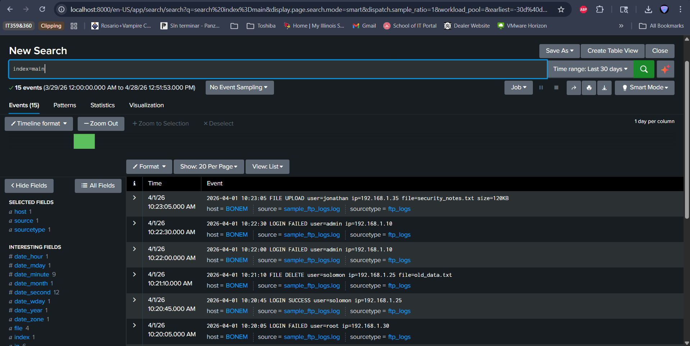
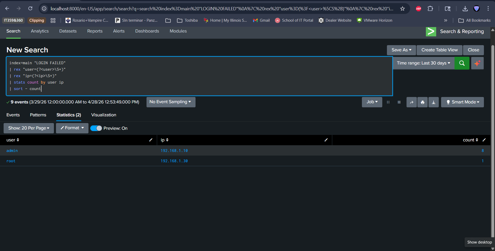
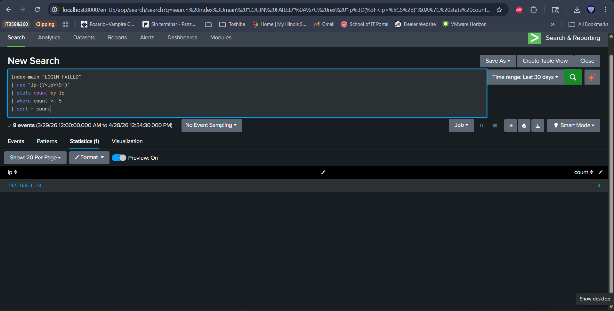
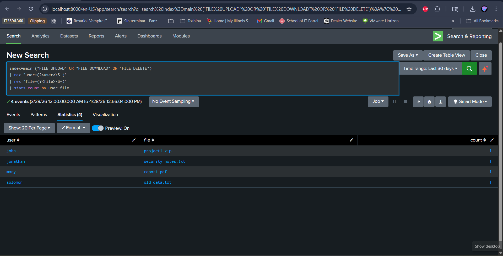
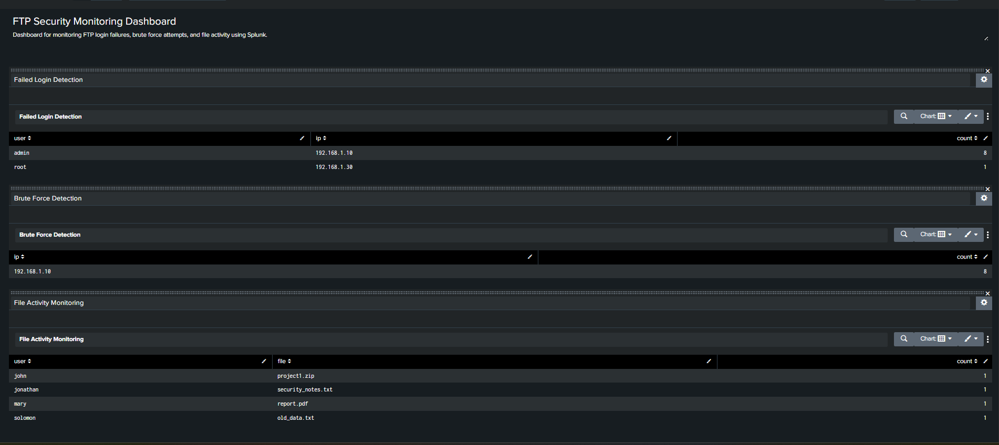
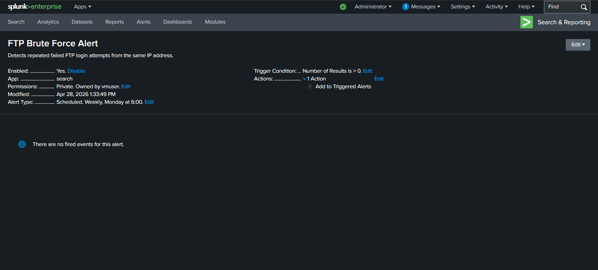

# IT360 Final Project: FTP Log Analysis Using Splunk

## Overview
This project focuses on analyzing FTP server logs using Splunk to detect suspicious activities such as failed login attempts, brute force attacks, and unusual file transfers.

The goal is to simulate a real-world cybersecurity monitoring system.

---

## Team Members
- Olatunbosun Moibi — Project Manager
- Solomon Oduma — Splunk Engineer
- Jonathan Eghan — Security Analyst
- All Team Members — Documentation Lead

---

## Objectives
- Generate FTP logs
- Ingest logs into Splunk
- Extract and normalize log data
- Detect suspicious behavior
- Build dashboards and alerts

---

## Tools & Technologies
- Splunk (Free Version)
- FTP Server (FileZilla / vsftpd)
- GitHub
- Windows/Linux VM

---

## Repository Structure
docs/ → project documentation
screenshots/ → proof of work
logs/ → sample FTP logs
queries/ → Splunk detection queries

---

## Key Features
- Failed login detection
- Brute force attack detection
- FTP activity monitoring dashboard
- Alert system for suspicious activity

---

## Screenshots

### Data Upload

### Search Results

### Failed Login Detection

### Brute Force Detection

### File Activity Monitoring

### Splunk Dashboard

### Alert Configuration

---

## Project Status
🚧 In Progress
